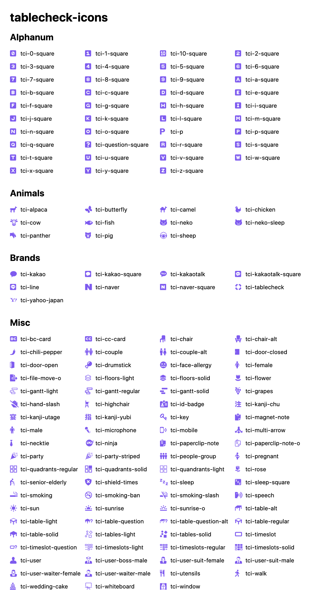
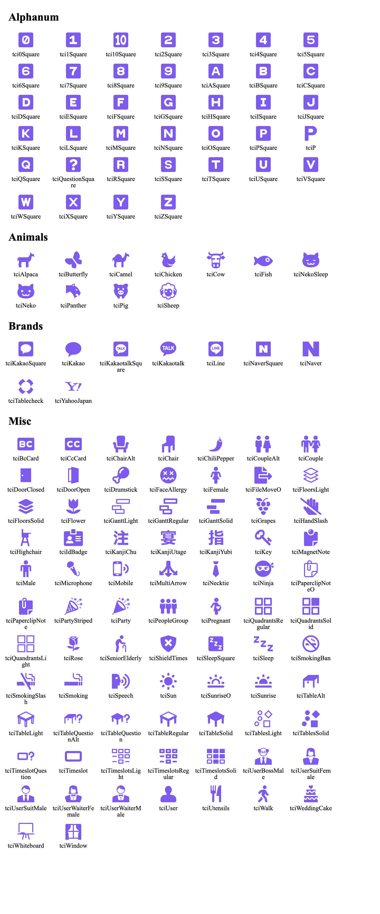

# TableCheck Icons

TableCheck Icons are an icon set and icon font based on 16px size, and compatible with [Font Awesome](https://fontawesome.com) version 5.x.

TableCheck Icons are made with ❤ by [Tablecheck](https://corp.tablecheck.com), the leading restaurant reservation app maker.
If **you** are a ninja-level Javascript/Ruby coder, designer, project manager, etc. and are eager to work in Tokyo, Japan
in a dynamic environment, please get in touch at [careers@tablecheck.com](mailto:careers@tablecheck.com).

TableCheck Icons are the successor to [Vesper Icons](https://github.com/tablecheck/vesper-icons).

### Distributions

TableCheck Icons are distributed in the following forms:

* As raw SVGs taken directly from this repository or from the npm install.
* As an icon font in OTF, TTF, WOFF, EOT, and SVG formats. Includes accompanying CSS and demo HTML file. Fonts are bundled in the npm install and via jsdelivr cdn; `https://cdn.jsdelivr.net/npm/tablecheck-icons@X.X.X/fonts`
* As JS module exports via `npm install --save tablecheck-icons`

#### Icon Font

**NOTE:** any [Font Awesome](http://fontawesome.com) modifier classes may be used alongside the relevant class from the below image.
 
```html
<i class="tci-0-square"></i>
```



#### FontAwesome compatible JS Imports

```jsx
import { FontAwesomeIcon } from '@fortawesome/react-fontawesome';
import { tci0Square } from 'tablecheck-icons/tci0Square';

<FontAwesomeIcon icon={tci0Square} color="green" size="4x" />
```



### Adding new Icons

When adding new icons keep these steps in mind;

* Add the new SVG file to the correct folder under `./svg/<Category>`
* You do not need to edit `unicodeMap.json` unless it needs a specific Unicode, this will be auto generated in the build step
* Ensure the icon has  a height of 512 and a maximum width of 512 (may be thinner)
* Each SVG must have ONLY 1 path - multiple paths will be combined into one.
* Use the `non-zero` method for creating hollowed out inserts (for example 1-square.svg), _**DO NOT**_ use `even-odd`. 
* Run the conversion script to clean up the icon formats; `npm run convert ./file/glob/**/*.svg`
* Run `npm run build` to generate the font files and js files
* Run `npm run build:images` to generate the icon screenshots used in this readme, please doublecheck this image to make sure your icons were added successfully.

#### FontAwesome Duotone Note

Currently we do not support the creation of Duotone icons until FontAwesome completes it's implementation. Specifically their [React Fontawesome](https://fontawesome.com/how-to-use/on-the-web/using-with/react) implementation.

### Disclaimer

TableCheck Icons are an original creation. However, [some icons may resemble designs found elsewhere
on the internets](http://www.hanselman.com/blog/ThereIsOnlyOneCloudIconInTheEntireUniverse.aspx),
including variations of icons in [Font Awesome](http://fontawesome.io/).
If we've done something daft please raise an issue and we'll discuss in a civil manner.

**To Font Awesome:** If you'd like to take icons from our set and add them to FontAwesome,
we're all for it, please get in touch.

### License

- Icon designs are Copyright (c) [TableCheck Inc.](https://corp.tablecheck.com)
- The TableCheck Icons font is licensed under the SIL OFL 1.1:
  - http://scripts.sil.org/OFL
- TableCheck Icons CSS and other source code files are licensed under the MIT License:
  - http://opensource.org/licenses/mit-license.html
- The TableCheck Icons documentation is licensed under the CC BY 3.0 License:
  - http://creativecommons.org/licenses/by/3.0/
- Attribution is not required but much appreciated:
  - `TableCheck Icons by TableCheck - https://corp.tablecheck.com`
- TableCheck Icons intends to be license-compatible with [Font Awesome](http://fontawesome.io/). The FontAwesome license is available here: http://fontawesome.io/license
